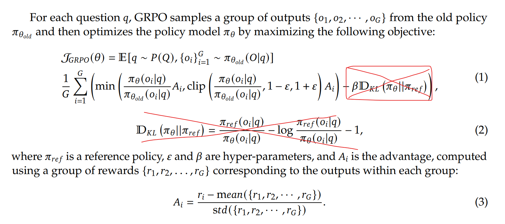
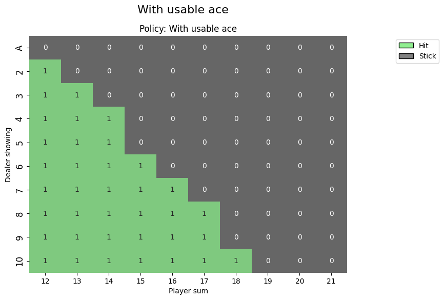
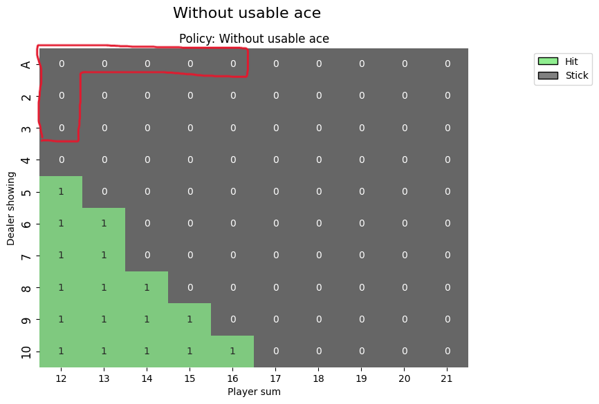
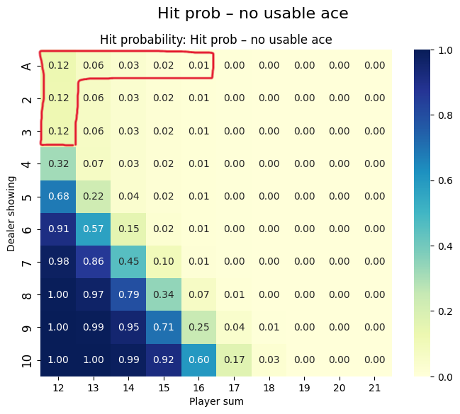
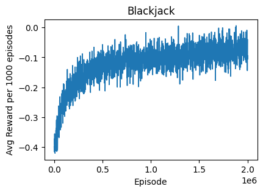
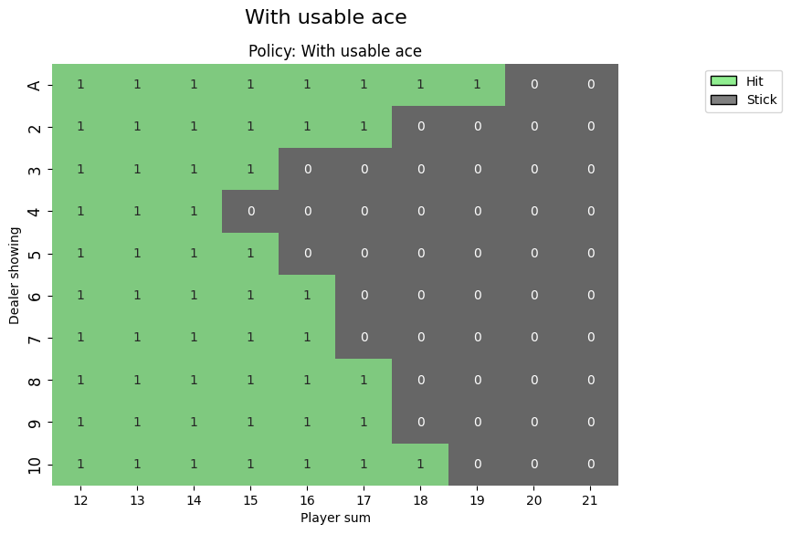
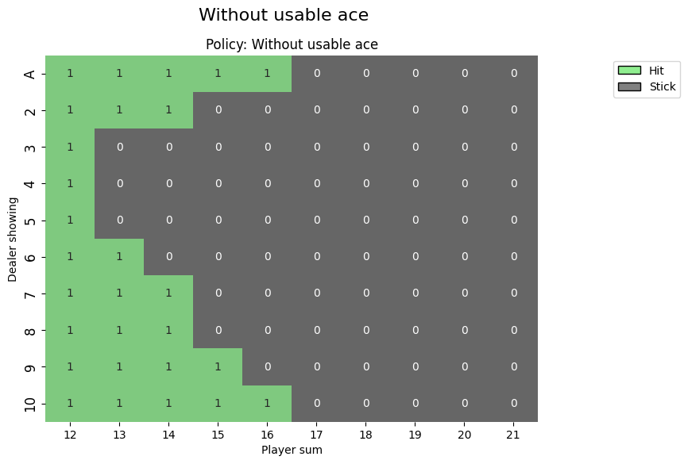
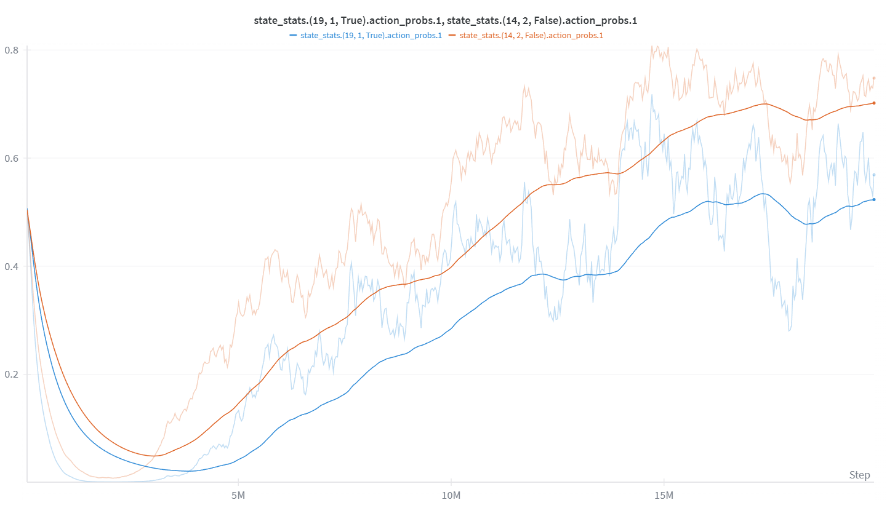
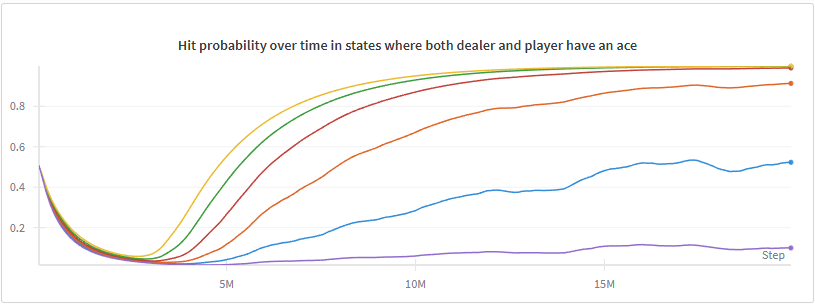

# grpo-blackjack
Implementation of DeepSeek's GRPO algorithm for Blackjack

This readme file works both as my notes for the project and as an explanation for anyone interested in the implementation.

## Goal of this project

The primary goal is hands-on learning of the Group Relative Policy Optimization (GRPO) algorithm used in the famous DeepSeek model.

## Background

A critical element of the GRPO algorithm is that even from your starting point you need a way to gain rewards in order to learn. The authors use a pre-trained LLM as a reference policy which is already capable of solving some of their training problems some of the time. I want to go for a small problem just to check if I can get this algorithm to converge to a good solution and I don't have a pre-trained model to start with or a lot of compute. In my opinion Blackjack would be a good problem for this use case as even with a random policy it will win some of the time thus enabling it to start learning. Gymnasium conveniently has a RL environment for Blackjack which I make use of.

In Deepseek's implementation they regulate the model to not drift too far away from the reference policy using KL Divergence term. Since I start with a random policy I can drop the whole KL divergence term in the formula as there is no need to keep it regulated towards a pre-trained model.

   
  <em> DeepSeek-R1: Incentivizing Reasoning Capability in LLMs via Reinforcement Learning: https://arxiv.org/pdf/2501.12948 </em>

The remaining algorithm is just a modification from the popular PPO algorithm to reduce the resource consumption. The difference really boils down to the advantage term *A*i. While the PPO algorithm needs to have another huge model (in case of LLMs) to estimate the value of each action outcome, GRPO foregoes this altogether and just makes groups out of similar trajectories and calculates the advantage as the reward relative to the group mean.

One thing to note is that this surely is NOT the optimal solution for blackjack - GRPO algorithm is in many ways wasteful, but for some problems it is one of the only ones that works without supervision. Therefore it is not as relevant to benchmark it against the speed of some of the other algorithms, but instead focus on if it can reach the same end result through a different reward scheme.

Since GRPO is newer and not a widely used solution it makes sense to first run tests with a known solution to the problem to make sure everything in the environment etc. is running smoothly without bugs. I took an existing PPO implementation from a university RL course for the Cartpole environment, modified it for Blackjack and it converged to a reasonable policy.

---

How to modify the training loop?

It is not possible to run the same starting hand for multiple runs without setting a seed, which would make the hands deterministic and ruin the idea of the advantage averaging out. Therefore the plan is to simulate many hands, e.g. 10k and then group them by the initial state for advantage calculation. In DeepSeek this would be the equivalent of them having some prompt to start with (e.g. a math question) and then they sample multiple responses. In the case of blackjack it would also be possible to group them by state, not just starting state. This could actually be even better as it increases samples in some of the states, but it would not be in the spirit of DeepSeek's GRPO implementation where a core idea is to use the same reward and advantage for every timestep in an episode.

Therefore for implementation I need:
1) Store episode numbers
2) Store initial states
3) Count advantages and distribute them to steps
4) Make sure updates are only done after episodes not within episodes like sometimes in PPO

## Initial Results - Run 1

Overall the models seems to converge to a reasonable policy, though not the optimal one. Practically the differences in performance are quite small: With this policy the reward is about -0.050 when the optimal policy yields -0.047, according to https://chisness.github.io/2020-09-21/monte-carlo-rl-and-blackjack. Their optimal policy, found with a Monte Carlo method after 10 million iterations is almost identical (there is a single difference) to the optimal policy proposed by Sutton and Barto in their RL book. Despite mean rewards being close to each other there are multiple differences in the policies.

  
  

For example, when it comes to the no usable ace scenario the policy is playing it too safe when the dealer is showing an ace. When taking a deeper look, we can see that at least in those states the propability of hitting is not zero, unlike in states where the choice is obvious.

  

After thinking about the issue I realized that the issue could be that for the option 'hit' to be a good choice, the latter choices need to be optimal too in this scheme. Rewards are based on the actual episode rewards (or their advantages to be more precise) and there is no value function that gives credit for the earlier good choice if a later bad choice loses the reward. This should be especially bad in the beginning of the training: You might be holding 14 and hit, but after getting lucky with a 6, the policy hits again and you bust losing the reward.

   
  <em>The graph from Weights & Biases shows the probability of hitting in a state where we have 14 and the dealer is showing an Ace. As expected, the model quickly learns to stick, but after roughly a million episodes it starts to slowly appreciate hitting more.</em>

The reason for this can be seen when checking how the model operates with an obvious choice where the hand is 21. Only sane option is to stick as hitting will only get you busted. Still, initially the probability is 50% from the randomly initialized neural net. Before it learns to stick here, all the hands with a lower value e.g. 14 will get a biased signal. And as you can see from the graph below, it takes like 500k episodes before the probability of hitting in that state gets close to zero.

  

At that point the model has already learned to stick in states like (14, 1, False) mentioned earlier. Since at that point the probability of hitting in such as state is low, there wont be many visits to the action of hitting in that state and the unlearning of the wrong strategy will take time. From the graph below it can be seen that such action in the state is often tried 1 or 0 times per update (25k hands). However, towards the end of the 2 million episodes the amount of visits starts to likely pick up as the action probability increases, suggesting that the speed of unlearning could accelerate.

  

This is strong evidence that 2 million episodes simply were not enough for the problem. There are also some states where the outcome of the two actions is extremely close: on this [blog post](https://chisness.github.io/2020-09-21/monte-carlo-rl-and-blackjack) the authours mention that when player has 16 and the dealer is showing a ten the difference between hitting and sticking is 0.000604 in favor of hitting, making it very difficult so get it right with a RL model. But even if all edge cases cannot be learned there is still some clear room for improvement and even the training loss seems to be slowly decreasing despite being volatile.

  

## Improved Results - Run 2

By running 20 million episodes the mean reward improved sligthly from 0.050 to 0.049. Seems small, but it gets it a lot closer to the optimal 0.047. When looking at the policy grids there are clear improvements. It now understands how to play a hand against dealer ace a lot better. In general, it chooses to hit in many new states compared to the previous policy which is good.

  
  

   
  <em>Average training reward improves roughly for the first 5 million episodes. For the second run I added average training reward to W&B so the graph is visually different from Run 1 training loss graph.</em>

When taking a look at the training loss and a previous problem state (14, 1, False) we can see how the action choice turns totally around after the first two million episodes.

   
  <em>In this state at 2 million episodes the probability to hit had gone down from initial 50% to only 0.6% due to early adjusting to bad play in possible future states, but after the model started performing better in those other states, it changed its mind and the probability to hit slowly increased up to 99.5% by the end of the training.</em>

However, despite these clear improvements the model still does not play optimally. Most of the states in which it picks a suboptimal choice are when holding a usable ace and total of 14-16 and the dealer is showing a mid range card from 3 to 7. These are one of the most difficult states to learn as states with a usable ace occur less frequently and the margins between the expected value of the actions are tiny. I suspect that for a small model and sensible amount of training this is expected for GRPO algorithm in blackjack. Since the margins between hit and stick are very small, even a slight chance of suboptimal play can make it choose to stick instead. When sticking, everything is left to random chance and the model guarantees the expected value for sticking in that state. However, when it chooses to hit the optimal expected value is the upper limit that can be achieved only if the future actions are also optimal every time. Since the action choice is probabilistic, even if it makes the right actions in test setting (correct action probability is over 50%) in training setting it could still choose a bad option with for example 0.5% of the time hurting the expected value. This risk even occurs multiple times if small cards are drawn. Therefore it could be that the absolute optimal policy is never reachable with this implementation of the GRPO algorithm.

This is not the full story though. While this hypothesis makes a lot of sense for states where the model chooses to stick instead of hit there are also two states where the opposite is true: the optimal strategy would be to stick, but our model hits: (19, 1, True) and (14, 2, False).

   
  <em>The probability of hitting first decreases, but then increases in these two special states where the model incorrectly chooses to stick. The action probability is noisy and changes to both directions over time. The trend is up though.</em>

In these states the policy initially learns to stick, but later on starts to increase the probability of hitting. The choices are close and the action probability is changing. However, especially for state (19, 1, True) the probability to hit stays over 50% for over 10 million episodes being roughly 70% at the end of the training, so it seems unlikely this is just due to chance. Right now I do not have a solid hypothesis for why this happens. According to sources such as [Sutton and Barto](http://www.incompleteideas.net/book/the-book-2nd.html) the optimal choice is to stick. In my opinion the model should be biases towards sticking, so this is puzzling. One possibility is that internal network learns to strongly associate having this double ace situation with hitting, and this carries over too strongly from other lower player sum states to also this state.

   
  <em>Hit probabilites when dealer is showing an ace and players has a usable ace and total sum from 15 (top yellow) to 20 (bottom purple). The only incorrect choice is made when player sum is 19 (blue).</em>

As can be seen from the graph similar states up to player sum of 18 strongly prefer hitting which could also spill over to this state.
